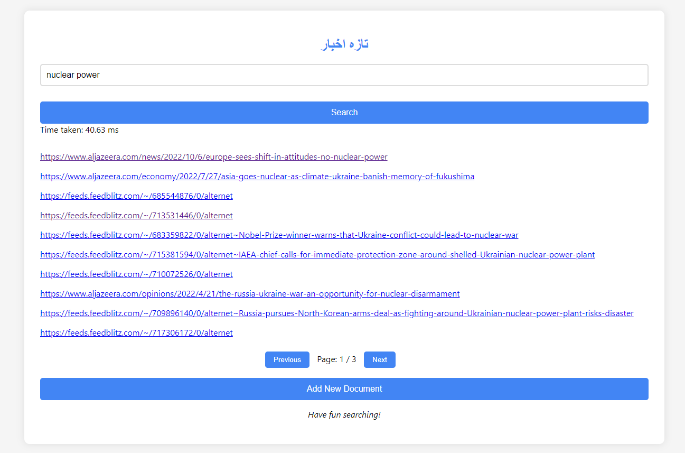

# تازہ اخبار

Taazaa Akhbaar is a Python-based search engine designed to handle a vast dataset of 120,000 articles in JSON format. It incorporates features like single and multi-word search queries, dynamic content addition, and efficient query handling. Leveraging libraries such as NLTK, JSON, and Flask, our search engine offers a user-friendly interface and achieves rapid response times.

## Features

- Support for single and multi-word search queries
- Dynamic content addition for extra documents
- User-friendly interface
- Efficient query handling

## Technology Stack

- Python
- NLTK
- JSON
- OS
- Hashlib
- heapq
- Flask

## Optimized Data Structures and Components

Taazaa Akhbaar's efficiency stems from meticulously crafted data structures like hash tables and lists. These structures manage queries, index files, and ranking, ensuring optimal performance. With forward and inverted indexes divided into barrels, our system stores essential data like word and document IDs, frequencies, and positions. A comprehensive lexicon and checksum file prevent duplication, while a custom ranking algorithm enhances search results based on word occurrence and frequency.

## Efficiency


Taazaa Akhbaar prioritizes efficiency, achieving constant-time retrieval (O(1)) by dividing indexes into barrels, which accelerates file handling and reduces CPU load. This meticulous implementation of data structures and algorithms exemplifies innovation in search engine technology, showcasing the potential of technology in today's dynamic digital landscape. We are excited to unveil our project, highlighting the transformative power of technology.

## Getting Started

To run Taazaa Akhbaar, follow these steps:

1. Clone the repository to your local machine.
2. Navigate to the `FrontEnd` Directory.
3. Open a terminal window and run the Flask app using the command:
```bash
python3 main.py
```
4. Start a live server to run the `search.html` file using a tool like Live Server in Visual Studio Code or any other preferred method.

## Screenshot



## Contributing

Contributions are welcome! Please feel free to fork the repository, make changes, and submit a pull request.
